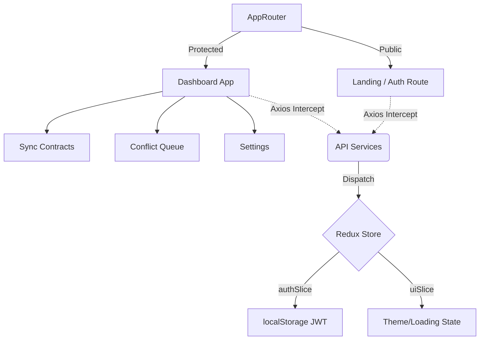

# BYND – Go Beyond Manual Data Entry

## The Challenge
Manual data entry between Excel, CRM systems, and Invoicing software plagues scaling SMBs globally. Teams waste critical hours copying records back and forth, leading to compounded versioning conflicts, human error, and disconnected financial insights. The lack of affordable, bidirectional sync solutions means data is fractured and highly unreliable.

## The Solution
BYND is the definitive no-code bidirectional sync engine. We bridge your CRM, ERP, and payment stacks to eliminate fragmented ecosystems. BYND features a proprietary conflict-resolution engine, AI-assisted field mapping, and automatic global tax compliance, guaranteeing that your data flows automatically and seamlessly.

## Impact
- **Time Saved:** Decreases manual reconciliation workloads from 16 hrs/wk down to 4 hrs/wk.
- **Error Elimination:** 100% reduction in version mismatches via Conflict Shield.
- **Data Integrity:** Total structural visibility and trust across your tech stack.

## Features Checklist
- [x] Spline 3D Bidirectional Hero Integration
- [x] Lenis Smooth Scrolling Engine
- [ ] Drag-and-Drop Mapping (dnd-kit)
- [ ] Automated Conflict Shield Resolution
- [ ] Bidirectional / Unidirectional State Toggles
- [ ] Custom Invoice Compliance Profiles
- [ ] Interactive Action Tables and Expanding Rows
- [ ] Dashboard KPI Sparklines (Recharts)

## Tech Stack
| Category | Technology |
|---|---|
| Framework | React 19 + Vite |
| Styling | Tailwind CSS v4, custom shadow/colour tokens |
| Components| shadcn/ui components (customized) |
| State | Redux Toolkit (auth/ui slices) |
| Routing | React Router v7 |
| Validation| Formik & Yup |
| Animation | Framer Motion, Lenis, Lottie |
| 3D Engine | @splinetool/react-spline |

## Architecture Diagram


## Getting Started
To replicate this environment locally:

```bash
# Clone repository
git clone https://github.com/your-username/bynd

# Install dependencies
npm install

# Run the development server
npm run dev
```

Ensure `.env` contains `VITE_API_BASE_URL=http://localhost:3000/api` (or production endpoint).

## Folder Structure
```text
src/
├── components/       # shadcn overrides, layout components, shared UI
├── pages/            # Top-level route components
├── features/         # Feature modules
├── hooks/            # Custom logic hooks (useAuth, useFetch)
├── services/         # Axios wrapper and endpoint services
├── store/            # Redux setup and slices
├── utils/            # Formatters and generic utilities
├── assets/           # Media and Spline JSONs
├── routes/           # AppRouter and Protected routes boundary
├── App.jsx           # Root wrapper
└── main.jsx          # Entrypoint
```

## Contributing & License
Property of BYND Inc. All Rights Reserved. Restricted external modification without explicit permission.
